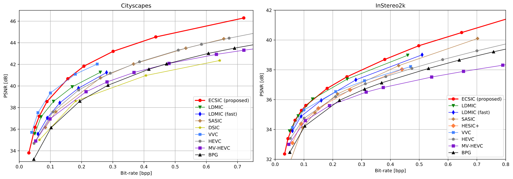

# ECSIC
Official code of our WACV paper "ECSIC: Epipolar Cross Attention for Stereo Image Compression" by Matthias Wödlinger, Jan Kotera, Manuel Keglevic, Jan Xu and Robert Sablatnig.


Check out the paper on **[arxiv](https://arxiv.org/abs/2307.10284)**.

## Installation

Install the necessary packages from the `requirements.txt` file with pip:

```pip install -r requirements.txt```

## Training
Train a new model with train.py. Example:

```python train.py gpu_idx exp_name --config configs/rd_cs_ecsic_m48.json --log_dir log_dir [--options]```

`gpu_idx` and `exp_name` need to be specified. The model weights are saved under `log_dir/experiments/HASH_DATE_TIME` (where HASH is added to prevent collisons for experiments with the same EXP_NAME). 

## Testing
Test a model with test.py. Example:

```python test.py gpu_idx exp_name --resume_dir experiments/RD_curves/cs/0.01/```

where `gpu_idx` and `exp_name` need to be specified and `resume_dir` can be set to any path with a config file `config.json` and weights file `model.pt` in it. Weights of trained models are available for download [here](https://drive.google.com/drive/folders/1ZHyAx4XmVRUAZDDS3PzmMOTEA1xKQOuc?usp=sharing). If the folder is copied to the project root the command above should replicate the results from our paper on Cityscapes for lambda=0.01 (bpp=0.089, psnr=38.56).

## Data

The data can be located anywhere you want, however the train and test scripts expect text files with paths to the data. ```data/load_cityscapes.py``` and ```data/load_instereo2k.py``` automatically create such text files for the Cityscapes and InStereo2k datasets. In case something does not work you can also create them by hand by creating ```train.txt```, ```eval.txt``` and ```test.txt``` where each line is ```left_image, right_image```. See ```data/DATASET_NAME``` for an example.

## Generate RD curves
Use generate_rd_curve.py to generate rate distortion curves. For this specifiy a list of lambda values in the command line as a string. E.g.:

```python generate_rd_curve.py gpu_dix exp_name --config configs/rd_cs_ecsic_m48.json --lmda "0.001, 0.01, 0.1"```

The program will then perform full train/test runs for all specified lmda values and store the results in a json file in `experiments/RD_curves/exp_name/results.json` and the model weights for the run with lambda=lmda in `experiments/RD_curves/exp_name/lmda`.

## RD Curves



Weights to reproduce these curves are available via [google drive](https://drive.google.com/drive/folders/1ZHyAx4XmVRUAZDDS3PzmMOTEA1xKQOuc?usp=sharing).

## Citation
If you use this project please cite our work

```
@inproceedings{wodlinger2024ecsic,
  title={ECSIC: Epipolar Cross Attention for Stereo Image Compression},
  author={W{\"o}dlinger, Matthias and Kotera, Jan and Keglevic, Manuel and Xu, Jan and Sablatnig, Robert},
  booktitle={Proceedings of the IEEE/CVF Winter Conference on Applications of Computer Vision},
  pages={3436--3445},
  year={2024}
}
```
